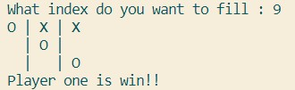

# tictaktoe-python

So this is my first project on Python which is TicTakToe game, and yes I still made a lot of mistake in this code but I'm learning from that and this is my journey to learn Python.

## How to play

You can play this game by **_click on the .exe file_** inside dist folder (dist\tiktaktoeV2.exe) and it will automatically run in your command prompt.

1. You can download it by using git command,
   `git clone https://github.com/Mephistoteles28/tictaktoe-python.git`
2. Run the file by selecting the .exe file inside **_dist\tiktaktoeV2.exe_**.

## Rules

And here some rules in this game:

1.  Two player needs to be able to play this on the same computer,
2.  First you will be asked by the game if you want to play or no, your input is `1` for play and `2` for exit.
    ```
        |   |
        |   |
        |   |
    WELCOME TO TICTACTOE GAMES
    1. Play
    2. Exit
    Choose what you want to do : 1
    ```
3.  First Player is asked to choose between `O` or `X`,
    ```
        |   |
        |   |
        |   |
    WELCOME TO TICTACTOE GAMES
    1. Play
    2. Exit
    Choose what you want to do : 1
    Choose between 'O' or 'X' :
    ```
4.  If the first player chooses `O`, it means the second player will use `X`,
    ```
        |   |
        |   |
        |   |
    WELCOME TO TICTACTOE GAMES
    1. Play
    2. Exit
    Choose what you want to do : 1
    Choose between 'O' or 'X' : O
    Make a move player 1,
    What index do you want to fill :
    ```
5.  Here is a simple explanation for the indexing in this game,

    ```
      [1] | [2] | [3]
      [4] | [5] | [6]
      [7] | [8] | [9]
    ```

    **Our index is start from _left to right_ and _top to bottom_.**

6.  Both players will choose what index to put the `O/X`.

    ```
      O |   |
        |   |
        |   |
    WELCOME TO TICTACTOE GAMES
    1. Play
    2. Exit
    Choose what you want to do : 1
    Choose between 'O' or 'X' : O
    Make a move player 1,
    What index do you want to fill : 1

    ```

7.  If one of the players qualifies to win, the system will tell it.

    
